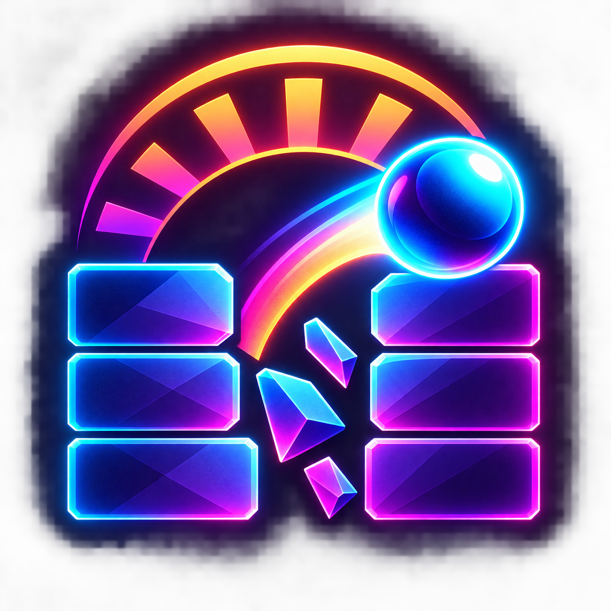

# Break the Quiet Days

<p align="center">
  
</p>

A native, cozy-surreal Breakout game for Apple Silicon Macs. Restore color and music to 24 handcrafted rooms across eight quiet days.

## What is new in 1.1

- **Sunshift:** after the first three gentle rooms, levels have two phases. Clear the pale shapes first; the ball then turns bright yellow and can hit only the yellow bars marked with a ☀ glyph.
- **Five brick silhouettes:** rounded tiles, capsules, diamonds, hexagons, and triangles use matching lightweight collision geometry.
- **Six new rooms:** Prism Workshop and Golden Hour extend the campaign with tougher walls, faster balls, narrower paddles, and new formations.
- **Clearer game UI:** level cards preview difficulty, available shapes, and Sunshift; the in-game HUD always names the active phase and remaining target family.

## Neon-retro redesign

- Adjustable launch aiming: drag from the waiting ball and release, use Left/Right before launch, or aim with a controller's right stick.
- Eight generated synthwave environment backdrops with a matching neon SwiftUI shell.
- Optically balanced neon block geometry, richer offset formations, and indestructible cyan obstacles from Day 3 onward.
- Generated skins for every brick silhouette, the energy ball, and the hover-launch paddle; canonical SpriteKit paths still own all collisions.
- A dedicated ball, fractured-block, and sunrise emblem that remains readable from the 16 px Finder icon through the 1024 px master.

## Play

Open `BreakTheQuietDays.xcodeproj` in Xcode and run the **BreakTheQuietDays** scheme. A signed arm64 build is also installed at `~/Applications/Break the Quiet Days.app`.

### Controls

- Move: trackpad/mouse, **A / D**, **Left / Right**, or a controller thumbstick
- Launch: click, **Space**, or controller **A**
- Pause: **Escape** or controller **Menu**
- Full screen: **Control-Command-F**

The aim guide, music/effect volume, and reduced-motion mode are available in Settings.

## Build

```sh
xcodegen generate
xcodebuild -project BreakTheQuietDays.xcodeproj -scheme BreakTheQuietDays -configuration Release -derivedDataPath DerivedData build
```

The game targets macOS 14+, stores progress locally in UserDefaults, and makes no network connections. Bundled artwork is decorative; gameplay geometry is built natively at runtime.
